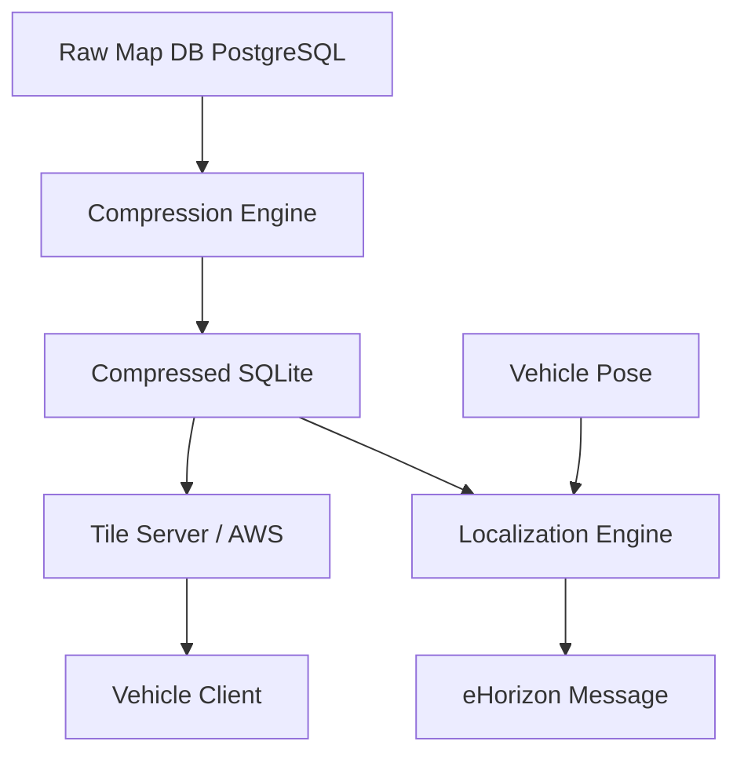

# hd-map-runtime
This project touches on the fundamentals of a moderns ADAS/Autonomy system.

Problem Statement
Modern autonomous vehicles require HD maps that are accurate, lightweight, and continuously up to date. This project tackles three interconnected runtime challenges:

Problem 1: Map Creation & Compression (Python)
Raw HD map databases are dense and impractical for onboard use. This component parses a full-resolution map database and applies a point density reduction algorithm, producing a compressed SQLite database that retains only the geometry an autonomous system needs at runtime.

Problem 2: Map Deployment Python
A production fleet cannot rely on manual map updates. This component implements a cloud-hosted tile server (AWS) and a lightweight vehicle-side client that keeps a large number of vehicles current with minimal bandwidth, delivering only the map tiles relevant to each vehicle's planned route.

Problem 3: Map Localization C++
With an updated compressed map onboard, the vehicle must find itself with in the map. This component fuses the vehicle's real-time pose with the compressed SQLite database (Problem 1) to localize the vehicle and surface the lane geometry immediately relevant to its current position.

System architecture diagram

Component overview with links to each sub-folder
How to run the full stack locally
Link to your ADRs
