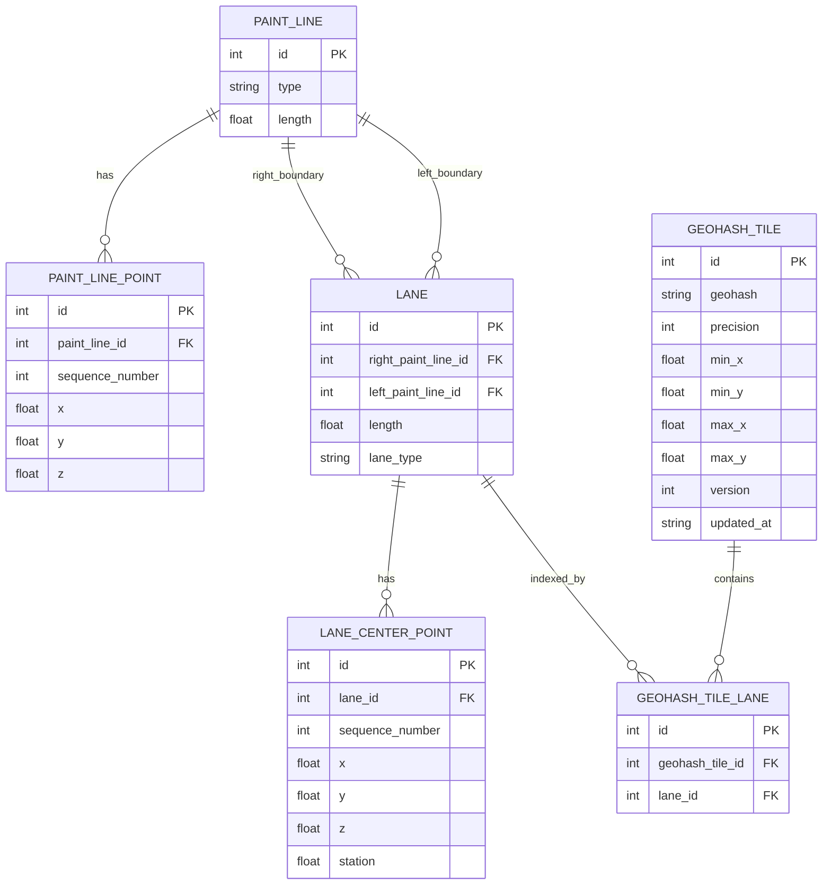

# Database Design

## Dense Map Schema

```mermaid
erDiagram
  PAINT_LINE {
    int id PK
    string type
    float length
  }
  PAINT_LINE_POINT {
    int id PK
    int paint_line_id FK
    int sequence_number
    float x
    float y
    float z
  }
  LANE {
    int id PK
    int right_paint_line_id FK
    int left_paint_line_id FK
    float length
    string lane_type
  }
  LANE_CENTER_POINT {
    int id PK
    int lane_id FK
    int sequence_number
    float x
    float y
    float z
    float station
  }
  GEOHASH_TILE {
    int id PK
    string geohash
    int precision
    float min_x
    float min_y
    float max_x
    float max_y
    int version
    string updated_at
  }
  GEOHASH_TILE_LANE {
    int id PK
    int geohash_tile_id FK
    int lane_id FK
  }
  PAINT_LINE ||--o{ PAINT_LINE_POINT : has
  LANE ||--o{ LANE_CENTER_POINT : has
  PAINT_LINE ||--o{ LANE : right_boundary
  PAINT_LINE ||--o{ LANE : left_boundary
  GEOHASH_TILE ||--o{ GEOHASH_TILE_LANE : contains
  LANE ||--o{ GEOHASH_TILE_LANE : indexed_by
```